# ServiceNow AI Platform

<div align="center">

**Enterprise AI-powered ServiceNow ITSM automation backend built with FastAPI, Clean Architecture, and resilient AI orchestration.**


</div>

---

## Table of Contents

- [Overview](#overview)
- [Project Status](#project-status)
- [Why This Project](#why-this-project)
- [Key Features](#key-features)
- [Architecture](#architecture)
  - [High-Level Architecture](#high-level-architecture)
  - [Clean Architecture Boundaries](#clean-architecture-boundaries)
  - [AI Provider Architecture](#ai-provider-architecture)
- [Core Workflows](#core-workflows)
  - [Incident Creation](#incident-creation-flow)
  - [Authentication and Email Verification](#authentication-and-email-verification-flow)
  - [ServiceNow Identity and Approval](#servicenow-identity-and-approval-flow)
  - [Protected Incident Creation](#protected-incident-creation-flow)
  - [Incident Confirmation Email](#incident-confirmation-email-flow)
- [Security Model](#security-model)
- [Data and Persistence](#data-and-persistence)
- [Project Structure](#project-structure)
- [API Surface](#api-surface)
- [Technology Stack](#technology-stack)
- [Design Principles](#design-principles)
- [Environment Configuration](#environment-configuration)
- [Prerequisites](#prerequisites)
- [Installation](#installation)
- [Database Setup](#database-setup)
- [Running the Project](#running-the-project)
- [API Examples](#api-examples)
- [Email Configuration](#email-configuration)
- [Testing](#testing)
- [Versioning](#versioning)
- [Roadmap](#roadmap)
- [Repository](#repository)
- [Contributing](#contributing)
- [Last Updated](#last-updated)
- [License](#license)
- [Author](#author)

---

## Overview

**ServiceNow AI Platform** is an enterprise-oriented backend that combines AI-powered incident processing with secure user authentication, persistent identity management, and ServiceNow integration.

The platform started as an AI-assisted incident creation service and has evolved into a multi-user backend with a security gate around ServiceNow operations.

At the current platform milestone, the system provides:

- Natural-language incident intake
- AI-powered incident classification
- Multiple AI providers with automatic failover
- Deterministic rule-based fallback
- ServiceNow REST integration
- PostgreSQL persistence
- SQLAlchemy async data access
- Alembic migrations
- JWT access and refresh tokens
- Password hashing
- Email verification with hashed OTPs
- Resend-based transactional email infrastructure
- ServiceNow `sys_user` identity lookup
- Automatic approval for existing ServiceNow users
- Manual enterprise access-request flow for users who are not yet present in ServiceNow
- ServiceNow identity mapping and synchronization fields
- Protected incident creation based on authentication, verification, approval, and identity state
- Incident confirmation emails
- Structured logging and centralized exception handling

The architecture is intentionally layered so that the application workflow does not depend directly on AI vendors, ServiceNow HTTP details, database implementation details, or email providers.

---

## Project Status

### Current Release / Milestone

| Item | Current State |
|---|---|
| Platform Release | **v0.2.0** |
| Platform Milestone | **Version 2 — Authentication & Enterprise Identity** |
| API Version | **v1** |
| API Base Path | **`/api/v1`** |
| Backend | FastAPI / Python 3.11 |
| Persistence | PostgreSQL + SQLAlchemy Async + Alembic |
| AI | Gemini + Ollama + Rule Engine |
| ITSM | ServiceNow REST integration |
| Email | Resend provider + shared email service |
| Authentication | JWT + password hashing |
| Email Verification | OTP generation, hashing, expiration, verification |
| Enterprise Identity | ServiceNow `sys_user` lookup and identity mapping |
| Approval | Automatic approval + manual access-request foundation |
| Incident Security | Authentication + verification + approval + identity gate |

> **Important:** Platform Version 2 is a product milestone, not API version 2. The current API remains **v1** and routes are exposed under **`/api/v1`**.

---

## Why This Project

Traditional incident creation requires a user or service-desk agent to translate an unstructured problem into structured ITSM fields such as category, subcategory, impact, urgency, and assignment group.

This platform moves that interpretation into an explicit application workflow:

1. Accept a natural-language issue.
2. Validate the API request at the boundary.
3. Delegate incident prediction to the AI Orchestrator.
4. Attempt providers in a defined failover order.
5. Receive a structured incident prediction.
6. Keep AI providers isolated from ServiceNow.
7. Let the Incident Service own the business workflow.
8. Let the ServiceNow Client own ServiceNow communication.
9. Persist platform state in PostgreSQL.
10. Require an authenticated and enterprise-approved identity before protected incident creation.

The same separation is used for identity and email workflows: application services coordinate business rules while infrastructure implementations handle PostgreSQL, ServiceNow, and Resend details.

---

## Key Features

### AI-Driven Incident Classification

The platform accepts a natural-language issue and produces structured incident information including:

- Short description
- Description
- Category
- Subcategory
- Assignment group
- Impact
- Urgency

The Incident Service consumes the prediction rather than allowing an AI provider to call ServiceNow directly.

### Multi-Provider AI Failover

The current provider chain is:

```text
Google Gemini
      ↓ failure
Ollama
      ↓ failure
Deterministic Rule Engine
```

The client does not need to know which provider produced the prediction. The Orchestrator owns provider selection and failover.

### Native ServiceNow Integration

The ServiceNow integration is isolated behind a client/infrastructure boundary. ServiceNow-specific operations are not embedded inside AI providers.

The platform currently uses ServiceNow for:

- Incident creation
- `sys_user` identity lookup
- Enterprise identity mapping
- Approval/provisioning integration paths
- Callback/webhook-oriented integration support

### Secure Multi-User Foundation

The backend now includes:

- User registration
- Username normalization and validation
- Password hashing
- JWT access tokens
- JWT refresh tokens
- Current-user extraction from bearer tokens
- Email verification
- Verification-code hashing
- Verification expiration checks
- ServiceNow identity verification
- Enterprise approval state
- Protected incident creation

### Enterprise Identity Linking

After email verification, the platform checks whether the user's email exists in the configured ServiceNow `sys_user` table.

If the ServiceNow identity exists, the platform stores the relevant identity mapping, including:

- ServiceNow `sys_id`
- ServiceNow username
- Synchronization-related state

The user can then enter the automatic approval path.

### Manual Access Request Foundation

If the email does not correspond to an existing ServiceNow user, email verification completes but access is not silently granted.

The user enters a manual access-request path with an access justification. Duplicate pending requests are blocked.

The broader provisioning/approval experience is designed around the ServiceNow-side enterprise workflow and callbacks.

### Transactional Email Infrastructure

Email delivery is abstracted behind a shared email service and provider interface.

Current implemented email usage includes:

- Email verification
- Incident creation confirmation
- Identity-related notification infrastructure

Resend is used as the current provider.

Development can use Resend's testing restrictions by redirecting outgoing messages to a configured testing recipient. Production can switch to normal per-user delivery after the sender domain is verified.

### PostgreSQL Persistence

The platform persists application state using:

- PostgreSQL
- SQLAlchemy async engine/session handling
- Repository abstractions
- Alembic migrations
- UUID-based entities
- Timestamp fields
- Soft-delete/status-oriented model support where applicable

### Structured Logging and Exception Handling

The platform uses centralized logging and exception handling so that API behavior remains consistent across validation, business, database, email, AI, and ServiceNow failures.

---

# Architecture

## High-Level Architecture

The platform has two major concerns that converge at the API boundary:

1. **AI-assisted ITSM operations** — incident prediction and ServiceNow execution.
2. **Enterprise identity and security** — registration, verification, ServiceNow identity linking, approval, and protected operations.

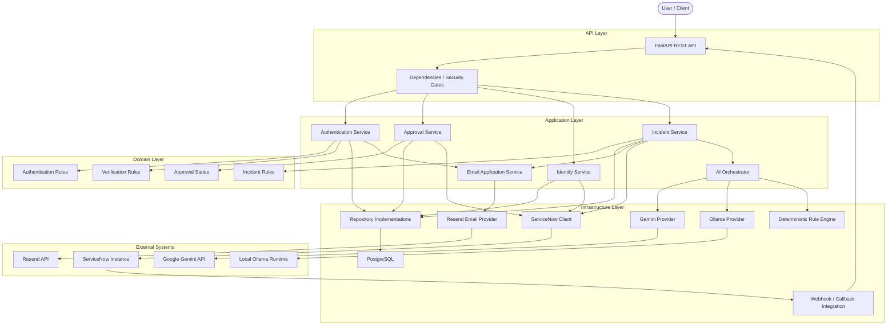

### Architectural Boundaries

The important boundaries are:

- **API layer** handles HTTP concerns and dependency wiring.
- **Application layer** owns use cases and business workflows.
- **Domain layer** contains business concepts and rules that should not depend on external systems.
- **Infrastructure layer** implements database, AI-provider, ServiceNow, email, and integration details.
- **External systems** remain outside the application's core business logic.

A particularly important rule is that **AI providers do not communicate directly with ServiceNow**. The Incident Service receives a prediction from the AI Orchestrator and then uses the ServiceNow Client to perform the ITSM operation.

---

## Clean Architecture Boundaries

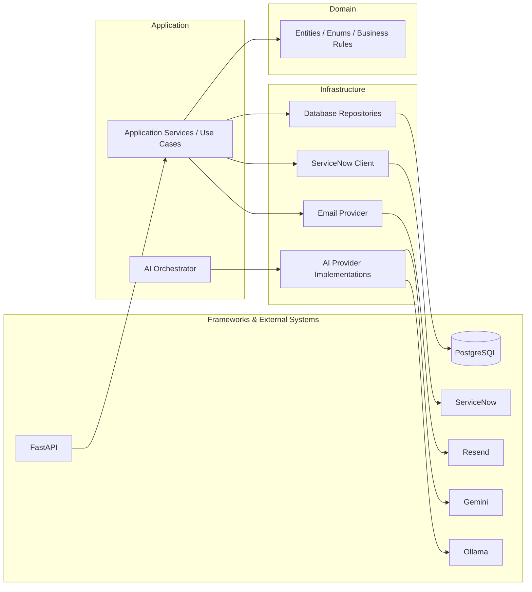

The architecture uses dependency inversion: application workflows depend on abstractions, while infrastructure supplies concrete implementations.

---

## AI Provider Architecture

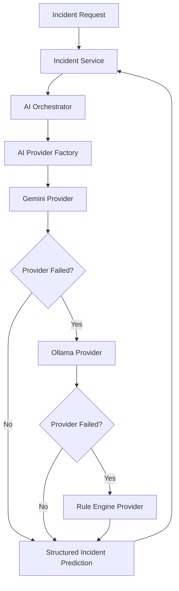

### Provider Responsibilities

| Component | Responsibility |
|---|---|
| Gemini Provider | Cloud-based AI incident prediction |
| Ollama Provider | Local-model incident prediction fallback |
| Rule Engine | Deterministic final fallback |
| AI Provider Factory | Resolves configured provider implementations |
| AI Orchestrator | Coordinates prediction and automatic failover |
| Incident Service | Owns the business workflow after prediction |

---

# Core Workflows

## Incident Creation Flow

The incident flow begins with a natural-language issue and ends with a ServiceNow incident response.

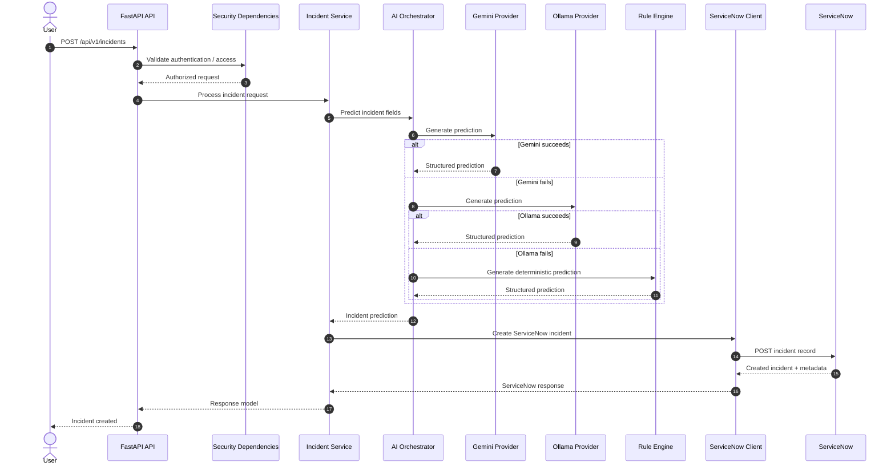

### Important boundary

The AI layer stops at **prediction**. It does not own ServiceNow execution.

The Incident Service decides what to do with the prediction, and the ServiceNow Client is responsible for external ServiceNow communication.

---

## Authentication and Email Verification Flow

Registration creates the platform identity first. The account must then pass email verification before enterprise access is evaluated.

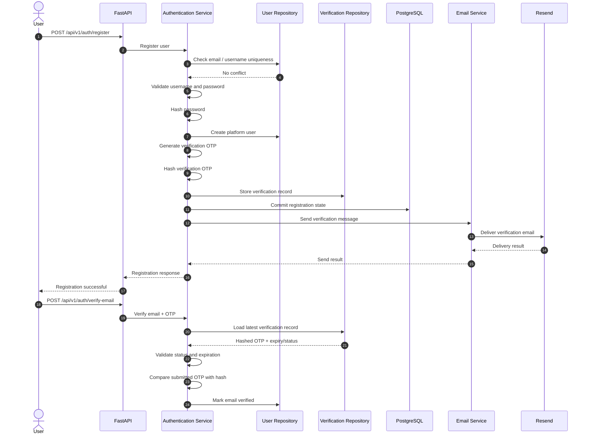

### OTP security

The verification code itself is not stored as plaintext. The generated OTP is hashed before persistence, and verification compares the submitted code against the stored hash.

The application also checks whether the verification record is already completed or expired before accepting the code.

---

## ServiceNow Identity and Approval Flow

Email verification is not equivalent to enterprise authorization. After verification, the platform checks the ServiceNow identity state.

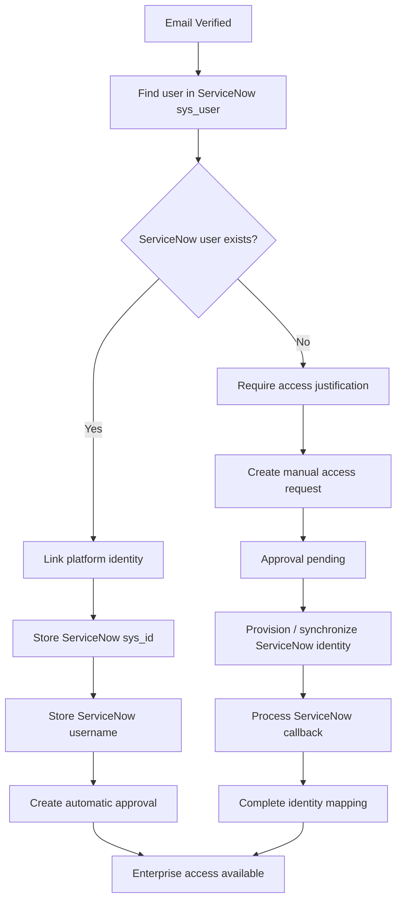

### Automatic path

When a matching ServiceNow `sys_user` exists, the platform records the ServiceNow identity and creates the automatic approval path.

### Manual path

When no matching ServiceNow identity exists, the platform does not grant access solely because the email was verified. The user submits an access justification and enters the manual approval/provisioning workflow.

---

## Protected Incident Creation Flow

The Week 2 security gate protects the existing incident-creation capability rather than creating a separate incident implementation.

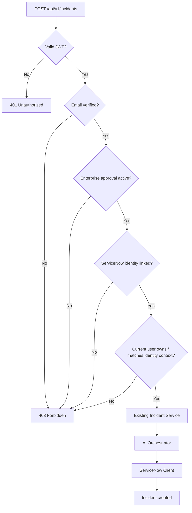

### Security behavior validated during Week 2

The implemented negative-path testing covered:

| Condition | Expected behavior |
|---|---|
| No JWT | `401 Unauthorized` |
| Invalid JWT | `401 Unauthorized` |
| Unverified email | `403 Forbidden` |
| Verified but not approved | `403 Forbidden` |
| Approved + verified authorized identity | Incident creation succeeds |

---

## Incident Confirmation Email Flow

The incident email uses the result of the existing incident creation workflow. The platform does not rerun AI analysis just to send the email.

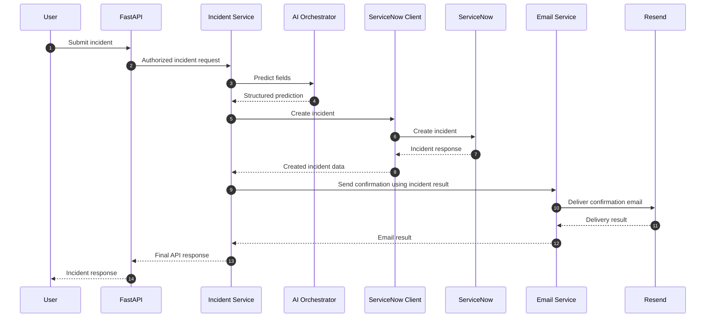

The confirmation template is designed to expose useful incident information while intentionally avoiding unnecessary internal identifiers such as the ServiceNow `sys_id` in the user-facing email.

---

# Security Model

The security model separates **authentication**, **email verification**, **enterprise approval**, and **ServiceNow identity linkage**.

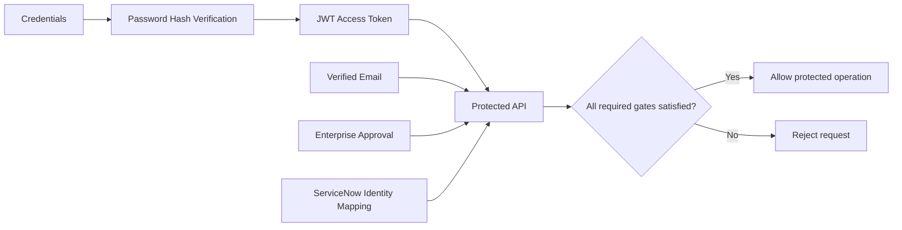

### Authentication

JWT bearer tokens are used for authenticated API access. The authentication dependency extracts the current platform user ID from the token subject.

### Passwords

Passwords are stored as hashes rather than reversible plaintext credentials. The application verifies submitted passwords against the stored hash during authentication.

### Email Verification

A verification code is generated, hashed, persisted with expiration metadata, and compared during verification. Raw OTP values should not be written to logs.

### Enterprise Approval

Authentication alone does not grant access to protected ServiceNow operations. Enterprise approval is a separate state.

### ServiceNow Identity

A platform user can be linked to a ServiceNow identity using ServiceNow `sys_user` information. The mapping is persisted so the protected incident workflow can associate platform actions with the enterprise identity.

### Secrets

Secrets such as database credentials, JWT secrets, ServiceNow credentials, Gemini API keys, Resend API keys, and webhook keys are configuration values and should not be committed to source control.

---

# Data and Persistence

## Persistence Architecture

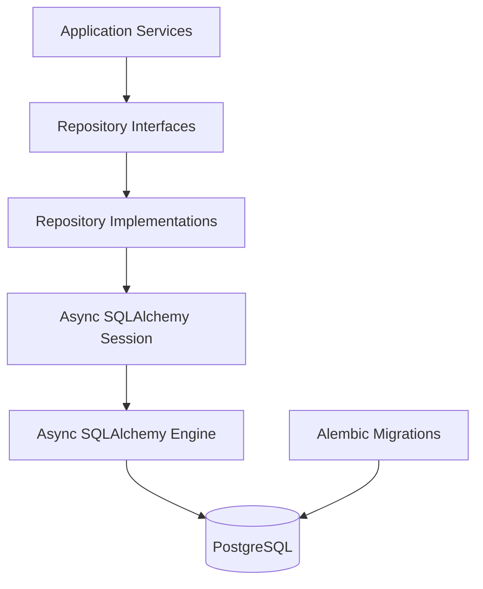

### Current persistence concerns

The current backend contains persistence models/repositories for application state including:

- Platform users
- Verification codes
- ServiceNow connections
- User approvals
- User preferences
- Incident-related state
- Conversation-related model foundations

The repository layer keeps database-specific operations outside application use-case logic.

### Migrations

Alembic is used to version database schema changes. Current Week 2 migrations include ServiceNow identity mapping and synchronization fields on the platform user model.

---

# Project Structure

The current backend structure reflects the expansion from the original V1 incident-only service into authentication and enterprise identity workflows.

```text
servicenow-ai-platform/
│
├── alembic/
│   ├── versions/
│   │   ├── 1e6f5fbbc139_add_servicenow_user_mapping.py
│   │   └── 41958662dfda_add_servicenow_sync_fields_to_user_.py
│   └── ...
│
├── app/
│   │
│   ├── api/
│   │   ├── dependencies/
│   │   │   ├── ai.py
│   │   │   ├── approval.py
│   │   │   ├── auth.py
│   │   │   ├── database.py
│   │   │   ├── email.py
│   │   │   ├── identity.py
│   │   │   ├── incident.py
│   │   │   ├── servicenow.py
│   │   │   ├── verification.py
│   │   │   ├── webhook.py
│   │   │   └── webhook_auth.py
│   │   │
│   │   └── v1/
│   │       ├── endpoints/
│   │       │   ├── ai.py
│   │       │   ├── approval.py
│   │       │   ├── auth.py
│   │       │   ├── health.py
│   │       │   ├── identity.py
│   │       │   ├── incident.py
│   │       │   ├── system.py
│   │       │   └── verification.py
│   │       └── router.py
│   │
│   ├── application/
│   │   ├── ai/
│   │   ├── approval/
│   │   │   ├── exceptions.py
│   │   │   ├── integration.py
│   │   │   ├── requests.py
│   │   │   ├── responses.py
│   │   │   └── service.py
│   │   ├── auth/
│   │   │   ├── exceptions.py
│   │   │   ├── requests.py
│   │   │   ├── responses.py
│   │   │   ├── service.py
│   │   │   └── username_suggestions.py
│   │   ├── email/
│   │   ├── identity/
│   │   └── incident/
│   │
│   ├── core/
│   │   ├── constants.py
│   │   ├── config.py
│   │   ├── lifespan.py
│   │   ├── logging.py
│   │   ├── settings.py
│   │   ├── security/
│   │   └── webhook.py
│   │
│   ├── domain/
│   │   ├── enums/
│   │   │   ├── approval.py
│   │   │   ├── connection.py
│   │   │   └── identity.py
│   │   ├── incident/
│   │   └── verification/
│   │
│   ├── infrastructure/
│   │   ├── ai/
│   │   │   └── providers/
│   │   ├── database/
│   │   │   ├── models/
│   │   │   │   ├── conversation.py
│   │   │   │   ├── incident.py
│   │   │   │   ├── servicenow_connection.py
│   │   │   │   ├── user.py
│   │   │   │   ├── user_approval.py
│   │   │   │   ├── user_preference.py
│   │   │   │   └── verification_code.py
│   │   │   └── repositories/
│   │   │       ├── base.py
│   │   │       ├── servicenow_connection.py
│   │   │       ├── user.py
│   │   │       ├── user_approval.py
│   │   │       └── verification_code_repository.py
│   │   ├── email/
│   │   │   ├── providers/
│   │   │   │   └── resend.py
│   │   │   ├── templates/
│   │   │   │   ├── base.html
│   │   │   │   ├── identity_linked.html
│   │   │   │   ├── incident_created.html
│   │   │   │   ├── password_reset.html
│   │   │   │   ├── verification.html
│   │   │   │   └── welcome.html
│   │   │   ├── models.py
│   │   │   ├── renderer.py
│   │   │   └── service.py
│   │   └── servicenow/
│   │       ├── approval_service.py
│   │       ├── client.py
│   │       ├── constants.py
│   │       ├── endpoints.py
│   │       ├── models.py
│   │       └── user_service.py
│   │
│   ├── schemas/
│   ├── exceptions/
│   ├── middleware/
│   ├── tests/
│   ├── utils/
│   └── main.py
│
├── .env.example
├── .gitignore
├── alembic.ini
├── README.md
├── requirements.txt
└── ...
```

### Layer responsibilities

| Layer / Folder | Responsibility |
|---|---|
| `api/` | HTTP routes, request handling, dependency injection, authentication gates |
| `application/` | Business use cases and workflow orchestration |
| `domain/` | Business entities, enums, and domain rules |
| `core/` | Configuration, logging, security utilities, constants, application lifecycle |
| `infrastructure/ai/` | Concrete AI provider implementations |
| `infrastructure/database/` | SQLAlchemy models, sessions, repositories, persistence |
| `infrastructure/email/` | Email provider, rendering, templates, email service implementation |
| `infrastructure/servicenow/` | ServiceNow client and enterprise integration implementations |
| `schemas/` | API-facing validation/serialization models |
| `exceptions/` | Centralized exception definitions/handlers |
| `tests/` | Automated tests |
| `main.py` | FastAPI application entry point |

---

# API Surface

The API is versioned under:

```text
/api/v1
```

Current route groups include:

| Group | Purpose |
|---|---|
| `/api/v1/auth` | Registration, login, token operations, username/account operations, access requests |
| `/api/v1/approval` | Enterprise approval-related operations |
| `/api/v1/identity` | ServiceNow/platform identity operations |
| `/api/v1/verification` | Email verification operations |
| `/api/v1/incidents` | Protected incident creation and incident operations |
| `/api/v1/ai` | AI-related operations |
| `/api/v1/health` | Health checks |
| `/api/v1/system` | System-level endpoints |

The exact request/response schemas are exposed through the generated OpenAPI specification.

---

# Technology Stack

| Category | Technology | Purpose |
|---|---|---|
| Language | Python 3.11 | Backend implementation |
| API Framework | FastAPI | REST API and dependency injection |
| ASGI Server | Uvicorn | Local/development server |
| Validation | Pydantic | Typed request/response validation |
| Database | PostgreSQL | Persistent application state |
| ORM / DB Access | SQLAlchemy Async | Async database access |
| Migrations | Alembic | Schema versioning |
| AI | Google Gemini | Primary AI provider |
| Local AI | Ollama | Local inference fallback |
| Fallback | Deterministic Rule Engine | Provider-independent final fallback |
| ITSM | ServiceNow | Enterprise incident and identity platform |
| HTTP | HTTPX | External HTTP communication |
| Authentication | JWT | Bearer-token authentication |
| Password Security | `pwdlib` hashing | Password hash generation/verification |
| Email | Resend | Transactional email delivery |
| Architecture | Clean Architecture | Layered separation of concerns |
| Patterns | Provider / Strategy / Repository | Extensibility and infrastructure isolation |
| Documentation | Swagger UI / OpenAPI / ReDoc | API documentation and testing |

---

# Design Principles

## Clean Architecture

Application and domain logic should not depend directly on external frameworks or vendors.

## SOLID

The project uses SOLID principles to keep responsibilities focused and dependencies replaceable.

## Dependency Injection

Dependencies such as database sessions, email services, and authentication services are supplied through FastAPI dependency wiring rather than being hard-coded inside route handlers.

## Provider Pattern

AI providers expose a common contract so the Orchestrator can work with Gemini, Ollama, and deterministic fallback implementations without embedding provider-specific logic into the Incident Service.

## Strategy Pattern

Provider selection/failover is handled as an orchestration strategy rather than scattering provider checks across the application.

## Repository Pattern

Database access is isolated behind repository implementations, keeping SQLAlchemy concerns out of the core business workflow.

## Separation of Concerns

The system separates:

- HTTP handling
- Business logic
- Domain rules
- Persistence
- AI providers
- ServiceNow integration
- Email delivery
- Security dependencies

---

# Environment Configuration

The application is configured through environment variables. Copy `.env.example` to `.env` and populate values for your environment.

## Core Configuration

Typical configuration groups include:

- Application
- AI providers
- ServiceNow
- API
- Logging
- HTTP
- PostgreSQL
- JWT/security
- Email
- Webhook authentication

### Example `.env` structure

```env
# ============================================================
# Application
# ============================================================
APP_NAME=ServiceNow AI Platform
APP_VERSION=0.2.0
ENVIRONMENT=development
DEBUG=true

# ============================================================
# API
# ============================================================
API_V1_PREFIX=/api/v1

# ============================================================
# Database
# ============================================================
DB_HOST=localhost
DB_PORT=5432
DB_NAME=servicenow_ai
DB_USERNAME=postgres
DB_PASSWORD=your_password
DB_ECHO=false
DB_POOL_SIZE=10
DB_MAX_OVERFLOW=20
DB_POOL_TIMEOUT=30
DB_POOL_RECYCLE=1800

# ============================================================
# AI
# ============================================================
AI_DEFAULT_PROVIDER=gemini
GEMINI_API_KEY=your_gemini_api_key
GEMINI_MODEL=your_gemini_model
OLLAMA_BASE_URL=http://localhost:11434
OLLAMA_MODEL=your_ollama_model

# ============================================================
# ServiceNow
# ============================================================
SERVICENOW_URL=https://your-instance.service-now.com
SERVICENOW_USERNAME=your_username
SERVICENOW_PASSWORD=your_password
SERVICENOW_TABLE=incident

# ============================================================
# Security
# ============================================================
ACCESS_TOKEN_SECRET=replace_with_a_strong_secret
REFRESH_TOKEN_SECRET=replace_with_a_strong_secret
JWT_ALGORITHM=HS256
ACCESS_TOKEN_EXPIRE_MINUTES=30
REFRESH_TOKEN_EXPIRE_DAYS=7

# ============================================================
# Email
# ============================================================
EMAIL_PROVIDER=resend
RESEND_API_KEY=your_resend_api_key
EMAIL_FROM_NAME=ServiceNow AI Platform
EMAIL_FROM_ADDRESS=onboarding@resend.dev

# Development / Resend testing mode
EMAIL_TEST_MODE=true
EMAIL_TEST_RECIPIENT=your_resend_registered_email@example.com

# ============================================================
# Webhook
# ============================================================
WEBHOOK_API_KEY=replace_with_a_strong_webhook_key

# ============================================================
# Logging / HTTP
# ============================================================
LOG_LEVEL=INFO
HTTP_TIMEOUT=30
```

> Do not copy real credentials into the repository. `.env` should remain ignored by Git.

---

# Prerequisites

Before running the backend locally, install/configure:

- Python 3.11+
- PostgreSQL
- Git
- A ServiceNow Developer Instance / PDI with the required integration configuration
- Google Gemini API access
- Ollama if local-model fallback is desired
- A Resend account/API key for email delivery

---

# Installation

Clone the repository:

```bash
git clone https://github.com/ANSH-TAANK/servicenow-ai-platform.git
cd servicenow-ai-platform
```

Create a virtual environment.

### Windows

```bash
python -m venv venv
venv\Scripts\activate
```

### Linux / macOS

```bash
python3 -m venv venv
source venv/bin/activate
```

Install dependencies:

```bash
pip install -r requirements.txt
```

Create the environment file:

```bash
copy .env.example .env
```

For Linux/macOS:

```bash
cp .env.example .env
```

Update `.env` with PostgreSQL, AI, ServiceNow, JWT, email, and webhook configuration.

---

# Database Setup

The backend uses PostgreSQL with SQLAlchemy's async stack and Alembic for schema migrations.

After configuring the database:

```bash
alembic upgrade head
```

To inspect the current migration state:

```bash
alembic current
```

To inspect migration history:

```bash
alembic history
```

When introducing a schema change, create a new Alembic revision and apply it through the normal migration workflow.

---

# Running the Project

Start the development server:

```bash
uvicorn app.main:app --reload
```

The application will be available at:

| Resource | URL |
|---|---|
| API | `http://127.0.0.1:8000` |
| Swagger UI | `http://127.0.0.1:8000/docs` |
| ReDoc | `http://127.0.0.1:8000/redoc` |
| OpenAPI Schema | `http://127.0.0.1:8000/openapi.json` |

---

# API Examples

## 1. Register

```http
POST /api/v1/auth/register
Content-Type: application/json
```

```json
{
  "full_name": "Example User",
  "username": "example_user",
  "email": "user@example.com",
  "password": "StrongPassword123!"
}
```

The registration workflow creates the platform user, generates a verification code, persists its hash, and sends the verification email through the configured email provider.

---

## 2. Verify Email

```http
POST /api/v1/auth/verify-email
Content-Type: application/json
```

```json
{
  "email": "user@example.com",
  "verification_code": "123456"
}
```

If the email corresponds to an existing ServiceNow `sys_user`, the identity-linking and automatic-approval path can continue. Otherwise, the API indicates that an access justification is required.

---

## 3. Request Enterprise Access

For a verified platform user who does not yet have a linked ServiceNow identity:

```http
POST /api/v1/auth/access-request
Content-Type: application/json
```

```json
{
  "email": "user@example.com",
  "justification": "I need ServiceNow access to manage enterprise IT incidents."
}
```

The service prevents duplicate pending access requests.

---

## 4. Login

```http
POST /api/v1/auth/token
Content-Type: application/x-www-form-urlencoded
```

The authentication layer returns access/refresh token information according to the current response schema.

Use the access token for protected endpoints:

```http
Authorization: Bearer <access_token>
```

---

## 5. Create an Incident

The existing incident endpoint is protected by the Week 2 security gate.

```http
POST /api/v1/incidents
Authorization: Bearer <access_token>
Content-Type: application/json
```

```json
{
  "issue": "My VPN is not connecting."
}
```

Equivalent cURL:

```bash
curl -X POST http://127.0.0.1:8000/api/v1/incidents \
  -H "Authorization: Bearer <access_token>" \
  -H "Content-Type: application/json" \
  -d '{
    "issue": "My VPN is not connecting."
  }'
```

Example response shape:

```json
{
  "success": true,
  "message": "Incident created successfully.",
  "incident": {
    "incident_number": "INC0010018",
    "short_description": "VPN Connection Failure",
    "description": "My VPN is not connecting.",
    "category": "Network",
    "subcategory": "VPN",
    "assignment_group": "Network Team",
    "impact": "2",
    "urgency": "2"
  }
}
```

The exact response is defined by the current API response models and ServiceNow integration.

---

# Email Configuration

## Development / Resend Testing

Resend's testing environment can restrict delivery to the account's verified/testing recipient. The platform therefore supports a test mode that redirects outgoing emails to a configured recipient while keeping the user's original email address in the database.

```env
EMAIL_PROVIDER=resend
EMAIL_TEST_MODE=true
EMAIL_TEST_RECIPIENT=your_resend_registered_email@example.com
EMAIL_FROM_ADDRESS=onboarding@resend.dev
```

This allows verification and incident-email workflows to be tested without purchasing a custom domain.

## Production

After verifying a sending domain in Resend, switch to normal recipient delivery:

```env
EMAIL_PROVIDER=resend
EMAIL_TEST_MODE=false
EMAIL_TEST_RECIPIENT=
EMAIL_FROM_ADDRESS=no-reply@yourdomain.com
```

In production mode, the email service uses the destination address supplied by the application message, so each user's registered email can receive the appropriate message.

### Email template architecture

The email system uses a single base layout with content-only child templates.

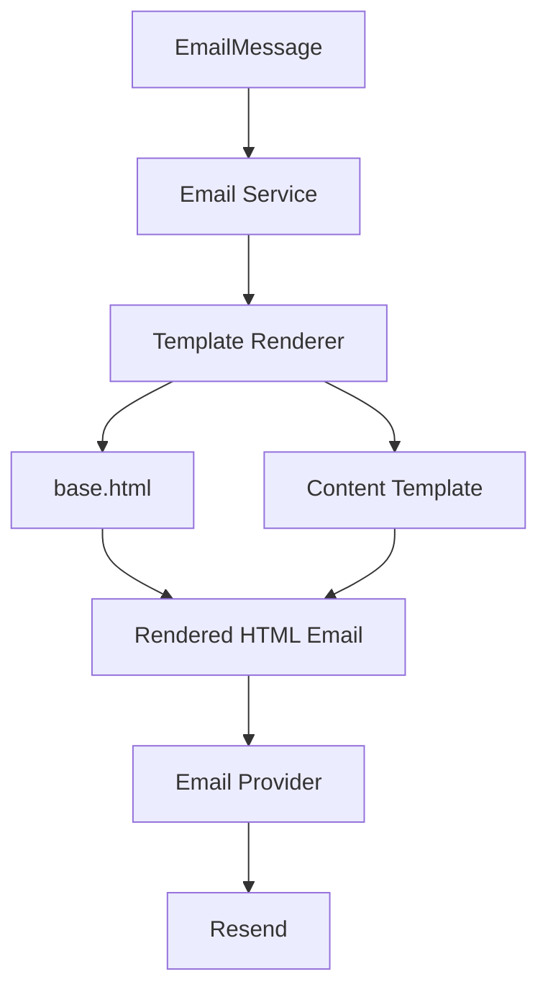

Current content templates include:

- `verification.html`
- `incident_created.html`
- `identity_linked.html`
- `password_reset.html` (template foundation only; reset workflow is deferred)
- `welcome.html` (template foundation only; onboarding/welcome workflow is deferred)

---

# Testing

The project includes automated tests under `app/tests/` and has been exercised through API-level verification of the Week 2 security flows.

The Week 2 verification matrix included:

```text
No JWT                    -> 401
Invalid JWT               -> 401
Unverified email         -> 403
Verified + unapproved    -> 403
Verified + approved      -> incident creation succeeds
```

Email delivery was also tested through Resend's testing configuration, including verification and incident confirmation messages.

When running the test suite locally:

```bash
pytest
```

> Test fixtures must satisfy the current database constraints. In particular, user fixtures require a valid password hash because `users.password_hash` is non-null.

---

# Versioning

The project uses two related but distinct version concepts.

### Platform version

The platform milestone represents the product's implementation stage.

```text
v0.1.0  -> Enterprise AI & ServiceNow foundation
v0.2.0  -> Authentication & enterprise identity
v0.3.0+ -> AI Copilot and subsequent capabilities
```

### API version

The HTTP API is currently versioned independently:

```text
API Version: v1
Base Path:   /api/v1
```

Therefore, **platform v0.2.0 does not mean `/api/v2`**.

---

# Roadmap

The roadmap below distinguishes completed work from planned work. Future capabilities are not presented as implemented until they are actually built and tested.

## Version 0.1.0 — Enterprise Backend Foundation — Completed

- [x] FastAPI backend
- [x] Clean Architecture
- [x] SOLID principles
- [x] Dependency Injection
- [x] Environment configuration
- [x] Structured logging
- [x] Global exception handling
- [x] AI provider abstraction
- [x] Google Gemini integration
- [x] Ollama integration
- [x] Deterministic Rule Engine
- [x] AI Provider Factory
- [x] AI Orchestrator
- [x] Automatic provider failover
- [x] Prompt management
- [x] Response parsing
- [x] Incident domain models and validation
- [x] ServiceNow REST client
- [x] Retry mechanism
- [x] Health APIs
- [x] AI APIs
- [x] Incident creation API
- [x] Swagger / OpenAPI
- [x] ReDoc

## Version 0.2.0 — Authentication & Enterprise Identity — Completed

### Persistence

- [x] PostgreSQL
- [x] SQLAlchemy async database access
- [x] Async engine/session management
- [x] Repository pattern
- [x] Alembic migrations
- [x] UUID-based entities
- [x] Timestamp support
- [x] Soft-delete/status model support
- [x] ServiceNow identity mapping fields
- [x] ServiceNow synchronization metadata

### Authentication

- [x] User registration
- [x] Username normalization/validation
- [x] Password hashing
- [x] JWT access tokens
- [x] JWT refresh tokens
- [x] Current-user extraction
- [x] Protected APIs
- [x] Email verification

### Email

- [x] Email provider abstraction
- [x] Resend provider
- [x] Shared email service
- [x] HTML email rendering
- [x] Shared base layout
- [x] Verification email
- [x] Incident confirmation email
- [x] Development/test recipient routing
- [x] Production-ready recipient routing model

### Enterprise Identity

- [x] ServiceNow `sys_user` lookup
- [x] Platform-to-ServiceNow identity mapping
- [x] Store ServiceNow `sys_id`
- [x] Store ServiceNow username
- [x] Synchronization fields
- [x] Automatic approval for existing ServiceNow users
- [x] Manual access-request foundation
- [x] Duplicate pending-request protection
- [x] Approval state tracking
- [x] ServiceNow approval/provisioning integration foundation
- [x] Webhook authentication foundation

### Incident Security

- [x] JWT security gate
- [x] Verified-email gate
- [x] Enterprise-approval gate
- [x] ServiceNow identity gate
- [x] User/identity ownership checks
- [x] Existing incident API reused behind the security gate
- [x] Incident confirmation email using existing incident output

## Version 0.3.0 — AI Copilot Foundation — Next

The next milestone focuses on AI Copilot capabilities rather than adding unrelated account features.

Planned areas:

- [ ] AI Copilot API foundation
- [ ] Context-aware assistance
- [ ] Conversational interaction model
- [ ] ServiceNow-aware AI context
- [ ] Knowledge retrieval foundation
- [ ] RAG pipeline
- [ ] Knowledge Base integration
- [ ] AI response grounding and validation

## Later AI / Agentic Milestones

Planned after the Copilot foundation:

- [ ] LangGraph workflow orchestration
- [ ] Specialized AI agents
- [ ] Knowledge Agent
- [ ] Incident Analysis Agent
- [ ] Validation Agent
- [ ] Routing Agent
- [ ] Human-in-the-loop workflows
- [ ] Multi-agent orchestration
- [ ] Intelligent incident draft/review workflow
- [ ] Duplicate incident detection
- [ ] Context-aware troubleshooting

## Later Platform Hardening

Planned only after the core AI workflows are implemented:

- [ ] Redis caching
- [ ] Celery/background workers
- [ ] Queue/retry infrastructure
- [ ] Rate limiting
- [ ] Advanced audit logging
- [ ] Prometheus/Grafana observability
- [ ] Docker deployment
- [ ] CI/CD
- [ ] Kubernetes deployment foundation
- [ ] Production performance/load testing

### Deferred features

The following are intentionally **not treated as completed** in the current release:

- Password reset workflow
- Welcome/onboarding email workflow
- Full AI Copilot
- RAG
- LangGraph multi-agent workflows
- Production Docker/Kubernetes deployment
- Full production observability stack

---

# Repository

GitHub:

```text
https://github.com/ANSH-TAANK/servicenow-ai-platform
```

The backend repository is separate from the ServiceNow PDI/Studio application source-control repository used for ServiceNow-side development.

---

# Contributing

Contributions are welcome.

For larger changes:

1. Open an issue or discussion first.
2. Keep changes focused on one concern.
3. Preserve the existing architecture and layer boundaries.
4. Add or update tests where appropriate.
5. Keep credentials and environment-specific secrets out of commits.
6. Update documentation when public behavior or architecture changes.

Pull requests should include a concise explanation of the problem, implementation, and validation performed.

---

# Last Updated

**18 September 2026**

---

# License

Licensed under the **MIT License**.

---

# Author

**Ansh Taank**

GitHub:

```text
https://github.com/ANSH-TAANK
```

Email:

```text
anshtaank24@gmail.com
```

---

<div align="center">

**ServiceNow AI Platform — Enterprise AI + ITSM Engineering**

</div>
