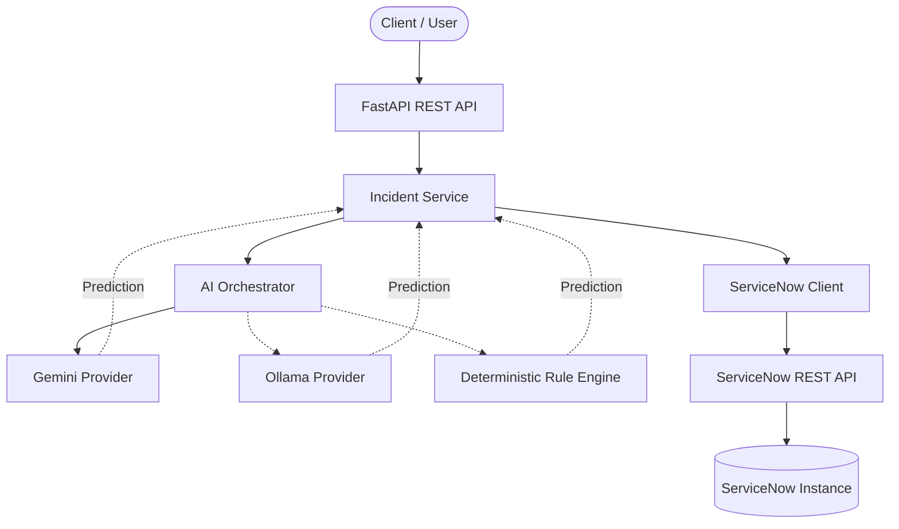
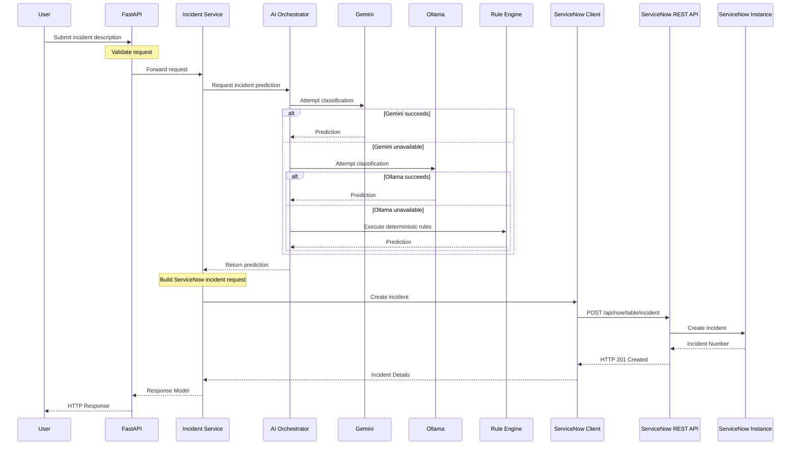

# ServiceNow AI Platform

<div align="center">

**Automated ServiceNow incident creation, powered by AI and clean architecture.**


</div>

---

## Table of Contents

- [Overview](#overview)
- [Why This Project?](#why-this-project)
- [Key Features](#key-features)
- [Current Release](#current-release--v010)
- [Architecture](#architecture)
- [Incident Processing Workflow](#incident-processing-workflow)
- [Project Structure](#project-structure)
- [Technology Stack](#technology-stack)
- [Design Principles](#design-principles)
- [Prerequisites](#prerequisites)
- [Installation](#installation)
- [Environment Configuration](#environment-configuration)
- [Running the Project](#running-the-project)
- [Example API Request](#example-api-request)
- [Example API Response](#example-api-response)
- [Roadmap](#roadmap)
- [Contributing](#contributing)
- [Last Updated](#last-updated)
- [License](#license)
- [Author](#author)

---

## Overview

ServiceNow AI Platform is a backend service that transforms natural-language
issue descriptions into fully classified ServiceNow incidents. Instead of
manually filling incident forms, users simply describe their problem in plain
English and the platform automatically predicts the appropriate classification,
routing information, and priority before creating the incident through the
ServiceNow REST API.

The application follows **Clean Architecture**, ensuring that business logic
remains independent from frameworks, infrastructure, and external services.
Each layer has a clearly defined responsibility, making the system easier to
maintain, test, and extend.

To maximize reliability, an AI Orchestrator automatically switches between
multiple AI providers whenever one becomes unavailable.

```
Google Gemini  →  Ollama (Local LLM)  →  Deterministic Rule Engine
```

Each provider is attempted in order. If one provider fails or becomes
unavailable, the next provider transparently continues the workflow, ensuring
incident creation remains uninterrupted.

---

## Why This Project?

Manually triaging incidents is slow and inconsistent: the same issue can be
categorized differently depending on who fills out the form, and routing
often depends on tribal knowledge of which team owns what. This project was
built to remove that manual step — a user describes the problem once, in
plain language, and the platform handles classification and routing
consistently every time.

An AI Orchestrator sits at the center of the prediction step because relying
on a single LLM provider for a production workflow introduces a single point
of failure: provider outages, rate limits, and API changes are common enough
that incident creation shouldn't depend on any one vendor staying available.
Multiple providers — Gemini for cloud-based inference, Ollama for local
inference, and a deterministic Rule Engine as a final fallback — give the
system a graceful degradation path instead of an outright failure when the
primary provider is unreachable.

Clean Architecture was chosen so that this provider chain, and the
ServiceNow integration itself, can evolve independently of one another. AI
providers can be added, replaced, or reordered, and ServiceNow could in
principle be swapped for another ITSM platform, without rewriting the
business logic that orchestrates the workflow. This layered design is what
makes the multi-provider failover practical rather than just theoretical —
each provider implements the same interface, so the orchestration logic
never needs to know which one actually produced the prediction.

---

## Key Features

### AI-Driven Incident Classification

From a single natural-language description, the platform automatically predicts:

- Short Description
- Description
- Category
- Subcategory
- Assignment Group
- Impact
- Urgency

---

### Multi-Provider AI Failover

Google Gemini acts as the primary AI provider.

If Gemini becomes unavailable, prediction automatically falls back to a local
Ollama model.

If both AI providers fail, a deterministic Rule Engine guarantees that a valid
incident prediction is still produced.

This architecture eliminates a single point of failure in the AI prediction
pipeline.

---

### Native ServiceNow Integration

Incidents are created directly using ServiceNow's official REST APIs.

The integration includes:

- Request validation
- Structured API responses
- Enterprise-grade exception handling
- Automatic incident creation

---

### Enterprise Architecture

The project is built using modern backend engineering practices including:

- Clean Architecture
- SOLID Principles
- Domain-Driven Design (DDD)
- Dependency Injection
- Provider Pattern
- Strategy Pattern
- Separation of Concerns

These principles make introducing new AI providers or replacing infrastructure
components possible with minimal code changes.

---

### Interactive API Documentation

FastAPI automatically generates OpenAPI documentation and Swagger UI, allowing
every endpoint to be explored and tested directly from the browser.

---

### Environment-Based Configuration

Application configuration is managed through `.env` and `.env.example`,
allowing sensitive configuration values to remain outside version control while
supporting multiple deployment environments.

---

### Structured Logging

The platform produces structured logs across the entire application lifecycle,
including:

- Application startup
- AI provider execution
- ServiceNow communication
- Exception handling
- Incident creation workflow

This provides observability rather than simple debugging output.

---

### Centralized Error Handling

A unified exception handling layer ensures:

- Consistent API responses
- Clear error messages
- Separation between business and infrastructure exceptions

---

## Current Release — v0.1.0

- [x] FastAPI backend
- [x] Clean Architecture layering
- [x] ServiceNow integration
- [x] Google Gemini provider
- [x] Ollama provider
- [x] Deterministic Rule Engine
- [x] AI Orchestrator with automatic failover
- [x] Structured logging
- [x] Request validation
- [x] Swagger documentation

---

## Architecture

The project follows Clean Architecture by separating business logic from
frameworks, infrastructure, and external integrations. Every layer has a single
responsibility and communicates only through clearly defined interfaces.



The diagram above represents the actual execution flow implemented by the
application.

**Solid arrows** represent the normal request flow.

**Dashed arrows** represent provider failover or prediction responses returned
to the Incident Service.

The execution flow is:

1. The client sends a request to the FastAPI REST API.
2. FastAPI forwards the request to the Incident Service.
3. The Incident Service delegates prediction to the AI Orchestrator.
4. The AI Orchestrator attempts classification using Google Gemini.
5. If Gemini fails, execution automatically falls back to Ollama.
6. If Ollama also fails, the Rule Engine generates a deterministic prediction.
7. The successful provider returns the prediction to the Incident Service.
8. The Incident Service constructs the ServiceNow request.
9. The ServiceNow Client performs the REST call to ServiceNow.
10. ServiceNow creates the incident and returns the response.

A key architectural boundary is that AI providers never communicate directly
with ServiceNow. Their only responsibility is generating incident predictions.
The Incident Service owns the business workflow, while the ServiceNow Client is
the only component responsible for interacting with ServiceNow.

---

## Incident Processing Workflow

The following sequence diagram illustrates how an incident request moves through
the application, including the automatic AI failover mechanism.



The failover mechanism is completely transparent to the client. Regardless of
which provider generates the prediction, the remaining workflow remains exactly
the same.

---

## Project Structure

```text
app/
│
├── api/
│   ├── dependencies/
│   └── v1/
│       └── endpoints/
│
├── application/
│   ├── ai/
│   └── incident/
│
├── core/
├── domain/
│   └── incident/
├── infrastructure/
│   ├── ai/
│   │   └── providers/
│   └── servicenow/
├── schemas/
├── exceptions/
├── middleware/
├── tests/
├── utils/
└── main.py
```

| Folder | Responsibility |
|---|---|
| `api/` | REST endpoints, request routing, and dependency injection |
| `application/` | Use cases and orchestration — the AI Orchestrator and incident workflow |
| `core/` | Application configuration, settings, logging, and lifespan management |
| `domain/` | Core business logic and entities, independent of any framework |
| `infrastructure/` | Concrete implementations: AI providers and the ServiceNow client |
| `schemas/` | Pydantic request/response models used at the API boundary |
| `exceptions/` | Custom exception types and global exception handlers |
| `middleware/` | Request/response middleware |
| `tests/` | Test suite |
| `utils/` | Shared helper utilities |
| `main.py` | FastAPI application entry point |

---

## Technology Stack

| Category | Technology |
|-----------|------------|
| Language | Python 3.11 |
| Backend | FastAPI |
| AI Providers | Google Gemini, Ollama |
| AI Fallback | Deterministic Rule Engine |
| ITSM Platform | ServiceNow REST API |
| Data Validation | Pydantic |
| HTTP Client | HTTPX |
| Configuration | python-dotenv |
| Documentation | Swagger / OpenAPI |
| Architecture | Clean Architecture |
| Design Patterns | Strategy Pattern, Provider Pattern |
| Engineering Principles | SOLID, Domain-Driven Design, Dependency Injection |

---

## Design Principles

The project is intentionally designed around modern software engineering
principles to ensure long-term maintainability and extensibility.

### Clean Architecture

Business logic remains independent of frameworks, external services, and
infrastructure.

### SOLID Principles

Every component follows clear responsibilities, making the application easier
to extend and maintain.

### Dependency Injection

Dependencies are injected rather than instantiated directly, improving
testability and reducing coupling.

### Provider Pattern

AI providers implement a common interface, allowing new providers to be added
without modifying application logic.

### Strategy Pattern

The AI Orchestrator dynamically selects the appropriate AI provider at runtime,
supporting automatic failover between providers.

### Separation of Concerns

Each layer owns a single responsibility, resulting in a modular and highly
maintainable codebase.

---

## Prerequisites

- Python 3.11 or later
- A ServiceNow Developer Instance
- Google Gemini API Key
- Ollama (optional, for local inference)
- Git

---

## Installation

> **Note:** The repository URL will be updated after the initial public release.

```bash
git clone https://github.com/ANSH-TAANK/servicenow-ai-platform.git
cd servicenow-ai-platform
```

Create and activate a virtual environment.

Windows:

```bash
python -m venv venv
venv\Scripts\activate
```

Linux/macOS:

```bash
python3 -m venv venv
source venv/bin/activate
```

Install dependencies:

```bash
pip install -r requirements.txt
```

---

## Environment Configuration

The project is configured entirely through environment variables, loaded from
a `.env` file at startup. A `.env.example` file is provided as a reference
for all required variables — copy it to `.env` and fill in the values for
your environment before running the application.

Configuration is organized into the following groups:

- **Application** — runtime settings such as host, port, and environment mode
- **AI Providers (Gemini & Ollama)** — credentials, model settings, and
  connection details for both providers
- **ServiceNow** — instance URL and credentials for the ServiceNow REST API
- **Logging** — log level and output format
- **HTTP** — client timeout and retry settings used for outbound requests
- **AI Provider Selection** — the default AI provider used by the
  Orchestrator can be set via environment configuration

**Never commit `.env` to version control.** It contains credentials and
instance-specific secrets and is excluded via `.gitignore`. Use
`.env.example` as the template for any new environment.

---

## Running the Project

Start the development server:

```bash
uvicorn app.main:app --reload
```

Once running, the application is available at:

| Resource | URL |
|---|---|
| API | `http://127.0.0.1:8000` |
| Swagger UI | `http://127.0.0.1:8000/docs` |
| OpenAPI Schema | `http://127.0.0.1:8000/openapi.json` |

---

## Example API Request

```http
POST /api/v1/incidents
```

```json
{
    "issue": "My VPN is not connecting."
}
```

Equivalent cURL command:

```bash
curl -X POST http://127.0.0.1:8000/api/v1/incidents \
  -H "Content-Type: application/json" \
  -d '{
    "issue": "My VPN is not connecting."
  }'
```

---

## Example API Response

```json
{
  "success": true,
  "message": "Incident created successfully.",
  "incident": {
    "incident_number": "INC0010018",
    "incident_sys_id": "6c21c6599735479020afb82de053afa8",
    "short_description": "VPN Connection Failure",
    "description": "My VPN is not connecting.",
    "category": "Network",
    "subcategory": "VPN",
    "assignment_group": "Network Team",
    "impact": "2",
    "urgency": "2"
  }
}
```

---

## Roadmap

### Version 0.1.0 — Backend Foundation

- [x] FastAPI Backend
- [x] ServiceNow Integration
- [x] Google Gemini Provider
- [x] Ollama Provider
- [x] Deterministic Rule Engine
- [x] AI Orchestrator
- [x] Structured Logging
- [x] Swagger Documentation

### Version 0.2.0 — Persistence Layer

- [ ] PostgreSQL
- [ ] SQLAlchemy
- [ ] Alembic
- [ ] Incident history

### Version 0.3.0 — Authentication & Security

- [ ] Authentication
- [ ] User management
- [ ] Role-based access control

### Version 0.4.0 — Intelligent Automation

- [ ] LangGraph
- [ ] RAG
- [ ] Knowledge base integration

### Version 1.0.0 — Production Release

- [ ] Docker
- [ ] Kubernetes
- [ ] CI/CD
- [ ] Monitoring
- [ ] Metrics
- [ ] Production deployment

---

## Contributing

Contributions are welcome. If you find a bug, have a feature request, or want
to improve the documentation, please open an issue to discuss it first for
larger changes. Pull requests should be focused, include a clear description
of the change, and follow the existing code style and architecture.

---

## Last Updated

30 June 2026

---

## License

Licensed under the MIT License.

---

## Author

**Ansh Taank**

GitHub
https://github.com/ANSH-TAANK

Email
anshtaank24@gmail.com

Issues, discussions, and pull requests are always welcome — feel free to
reach out or open an issue on the repository.